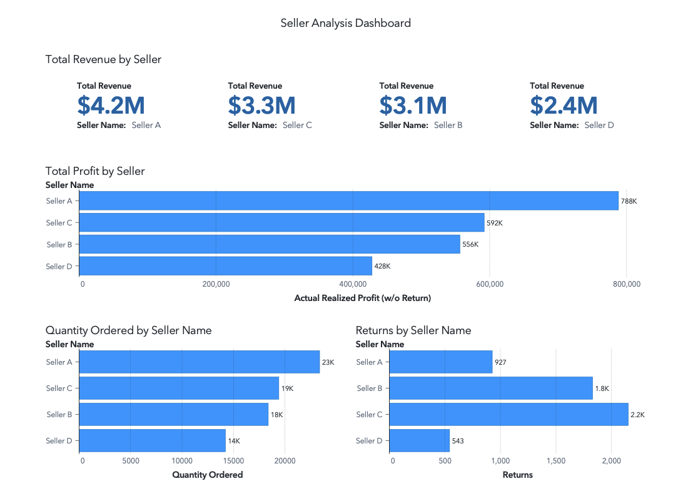
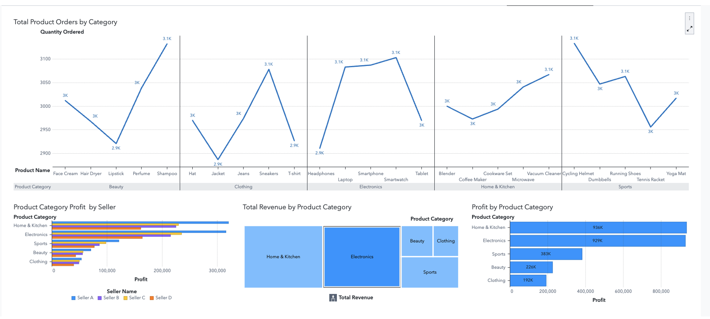
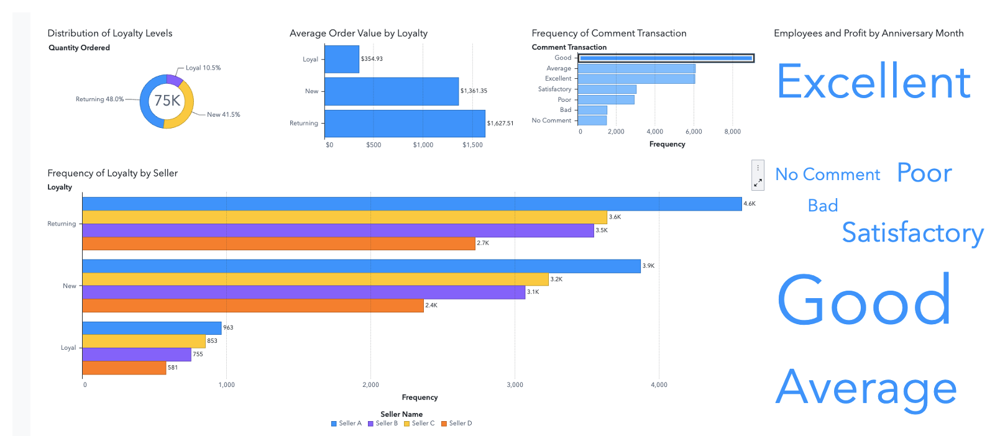
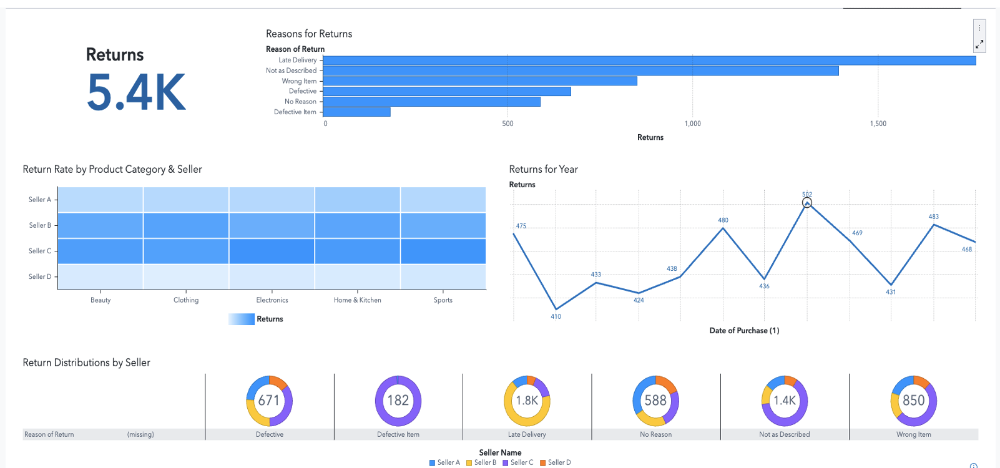

# E-commerce Revenue, Profitability & Customer Behavior Analysis

## Overview
Analyzed e-commerce transactional data to evaluate revenue, profitability, seller performance, and customer behavior. The goal was to identify key drivers of performance and uncover opportunities to improve operational efficiency and reduce losses from returns.

---

## Business Problem
Despite generating strong revenue, the platform experiences reduced profitability due to operational inefficiencies, particularly high return rates and inconsistent seller performance.

---

## Tools & Technologies
- SAS Viya
- Data Visualization & Dashboarding

---

## Key Insights

### 1. Revenue is Strong, but Returns Reduce Profitability
- Total Revenue: **$13M**
- Profit drops from **$2.7M → $2.1M after returns**

Returns reduce profit by approximately **$600K**

---

### 2. Seller Performance Varies Significantly

- Seller A leads in revenue and profit with low returns
- Seller C generates high revenue but has the highest returns

Some sellers drive growth but negatively impact profitability

---

### 3. Product Categories Drive Uneven Value

- Home & Kitchen and Electronics are top-performing categories
- Clothing and Beauty underperform

Product mix optimization is needed to improve margins

---

### 4. Customer Loyalty Drives Revenue

- Loyal customers spend significantly more per order
- Returning customers make up the largest segment

Increasing customer loyalty can boost revenue per customer

---

### 5. Returns Highlight Operational Issues

- Top return reasons:
  - Late delivery
  - Not as described
- Seller C has the highest return volume

Logistics and product accuracy are key drivers of returns

---

## Business Recommendations

- Improve logistics to reduce late deliveries
- Enhance product descriptions to align with customer expectations
- Support high-return sellers with quality control measures
- Invest in high-performing product categories
- Develop loyalty programs to increase repeat customer value

---

## Business Impact
This analysis demonstrates how data can be used to:

- Improve profitability by reducing return-related losses
- Optimize seller performance  
- Enhance customer retention strategies
- Support data-driven operational decisions

---

## Project Takeaway
This project highlights my ability to analyze complex business data, identify inefficiencies, and deliver actionable insights that improve performance in an e-commerce environment.
